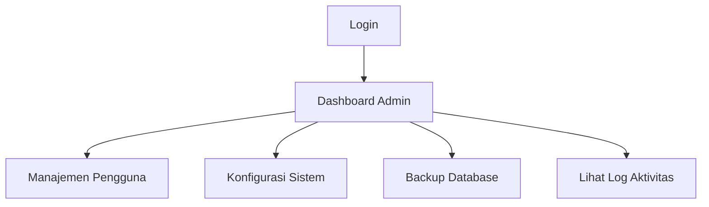
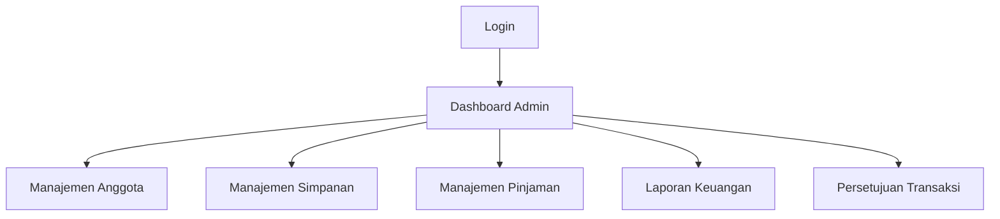
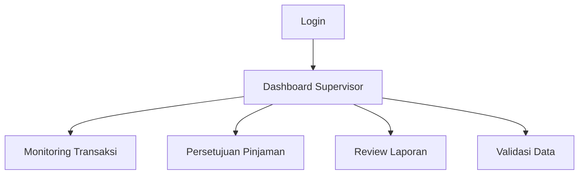
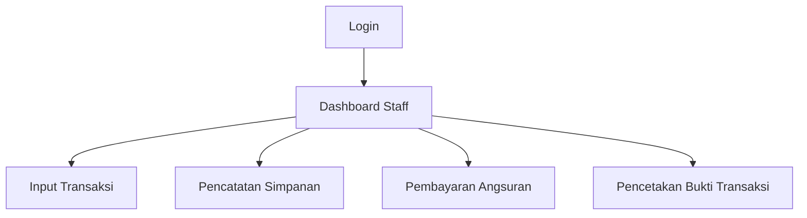
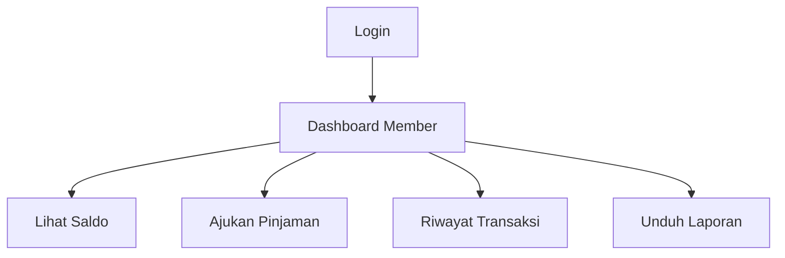

# Arsitektur Aplikasi KSP Samosir

## Daftar Isi
1. [Gambaran Umum](#gambaran-umum)
2. [Struktur Direktori](#struktur-direktori)
3. [Sistem Autentikasi & Otorisasi](#sistem-autentikasi--otorisasi)
4. [Role dan Permission](#role-dan-permission)
5. [Alur Kerja Per Role](#alur-kerja-per-role)
6. [Keamanan](#keamanan)
7. [Panduan Pengembangan](#panduan-pengembangan)

## Gambaran Umum

Aplikasi KSP Samosir dibangun dengan arsitektur MVC (Model-View-Controller) menggunakan PHP native. Sistem ini menggunakan pendekatan Role-Based Access Control (RBAC) untuk mengatur akses pengguna ke berbagai fitur aplikasi.

## Struktur Direktori

```
app/
├── config/           # File konfigurasi
├── controllers/      # Controller aplikasi
│   ├── admin/        # Controller khusus admin
│   ├── member/       # Controller khusus member
│   ├── supervisor/   # Controller khusus supervisor
│   └── staff/        # Controller khusus staff
├── core/             # Inti aplikasi
├── helpers/          # Fungsi-fungsi pembantu
├── middlewares/      # Middleware untuk otorisasi
├── models/           # Model database
└── views/            # Template view
    ├── admin/        # View untuk admin
    ├── member/       # View untuk member
    ├── supervisor/   # View untuk supervisor
    └── staff/        # View untuk staff
```

## Sistem Autentikasi & Otorisasi

### Autentikasi
- Menggunakan session PHP dengan regenerasi ID sesi
- Password di-hash menggunakan `password_hash()` dengan algoritma PASSWORD_BCRYPT
- Maksimal 5 percobaan login dalam 15 menit
- Session timeout 60 menit tidak aktif

### Otorisasi
- Menggunakan sistem RBAC dengan tabel:
  - `users` - Menyimpan data pengguna
  - `roles` - Daftar role yang tersedia
  - `permissions` - Daftar permission yang tersedia
  - `role_permissions` - Menghubungkan role dengan permission
  - `user_roles` - Menghubungkan user dengan role

## Role dan Permission

### Daftar Role
1. **super_admin** - Akses penuh ke seluruh sistem
2. **admin** - Manajemen operasional harian
3. **supervisor** - Monitoring dan persetujuan
4. **staff** - Input data transaksi
5. **member** - Anggota koperasi
6. **agen** - Agen/reseller
7. **investor** - Investor pihak ketiga

### Daftar Permission
```
# Manajemen Pengguna
- view_users
- create_users
- edit_users
- delete_users

# Manajemen Anggota
- view_anggota
- create_anggota
- edit_anggota
- delete_anggota

# Simpanan
- view_simpanan
- create_simpanan
- approve_simpanan
- cetak_bukti_simpanan

# Pinjaman
- view_pinjaman
- create_pinjaman
- approve_pinjaman
- bayar_angsuran

# Laporan
- view_laporan_keuangan
- view_laporan_anggota
- export_laporan

# Pengaturan
- manage_settings
- backup_database
- view_logs
```

## Alur Kerja Per Role

### 1. Super Admin


### 2. Admin


### 3. Supervisor


### 4. Staff


### 5. Member


## Keamanan

### 1. Perlindungan CSRF
- Setiap form harus menyertakan token CSRF
- Validasi token pada setiap request POST/PUT/DELETE

### 2. Validasi Input
- Sanitasi semua input pengguna
- Gunakan prepared statements untuk query database
- Validasi tipe data dan format input

### 3. Proteksi File
- Simpan file upload di luar direktori web root
- Validasi tipe dan ukuran file
- Rename file upload dengan nama acak

### 4. Logging
- Catat semua aktivitas penting
- Simpan IP address, user agent, dan timestamp
- Buat sistem notifikasi untuk aktivitas mencurigakan

## Panduan Pengembangan

### Menambahkan Role Baru
1. Tambahkan role baru di tabel `roles`
2. Tentukan permission yang dibutuhkan
3. Buat direktori controller dan view baru jika diperlukan
4. Update middleware otorisasi

### Menambahkan Permission Baru
1. Tambahkan permission baru di tabel `permissions`
2. Hubungkan dengan role yang sesuai di `role_permissions`
3. Update middleware untuk memeriksa permission

### Best Practices
1. Selalu gunakan fungsi helper untuk pengecekan permission
2. Jangan pernah mempercayai input pengguna
3. Gunakan transaction untuk operasi database yang terkait
4. Dokumentasikan setiap fungsi dan class
5. Tulis unit test untuk fungsi-fungsi kritis

## Troubleshooting

### Masalah Umum
1. **Tidak bisa login**
   - Periksa log error
   - Pastikan session berjalan dengan benar
   - Cek konfigurasi database

2. **Akses ditolak**
   - Periksa role dan permission user
   - Pastikan middleware otorisasi sudah benar
   - Cek log aktivitas

3. **Error database**
   - Periksa koneksi database
   - Pastikan tabel dan kolom ada
   - Cek query yang bermasalah di log

## Kontribusi

1. Fork repository
2. Buat branch fitur (`git checkout -b fitur/namafitur`)
3. Commit perubahan (`git commit -am 'Menambahkan fitur xyz'`)
4. Push ke branch (`git push origin fitur/namafitur`)
5. Buat Pull Request

## Lisensi

Proprietary - Koperasi Simpan Pinjam Samosir

---
Dokumen terakhir diperbarui: 14 Februari 2026
